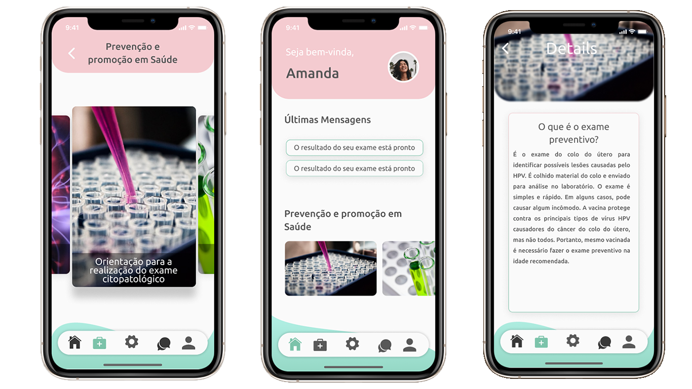

# front-end-mobile

## Table of contents
* [General info](#general-info)
* [Technologies](#technologies)
* [Screenshots](#screenshots)
* [Installation](#setup)

## General info
This project is a mHealth-based application that allows interaction between health professionals and women in the cervical cancer target population.
	
## Technologies
Project is created with:
* Expo : 41.0.1
* Typescript: 4.0.0

## Screenshots

<div>
  
</div>

	
## Setup
To run this project, clone this repo, install it locally using npm:

```
$ npm install
$ expo start
```
